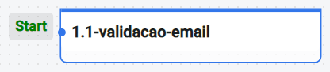
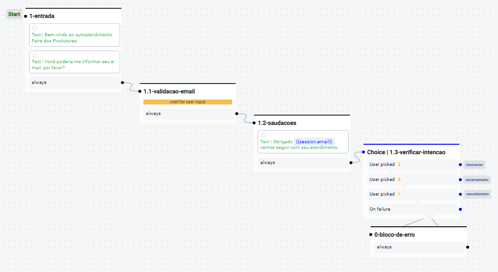
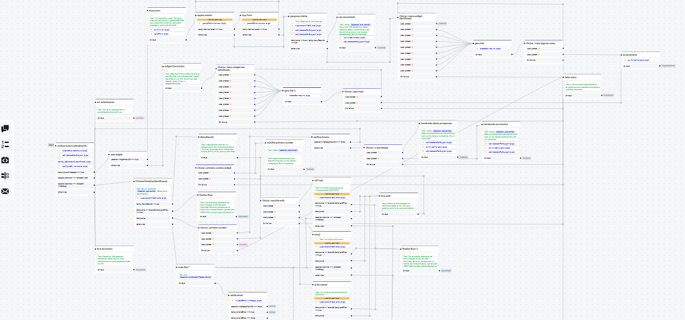
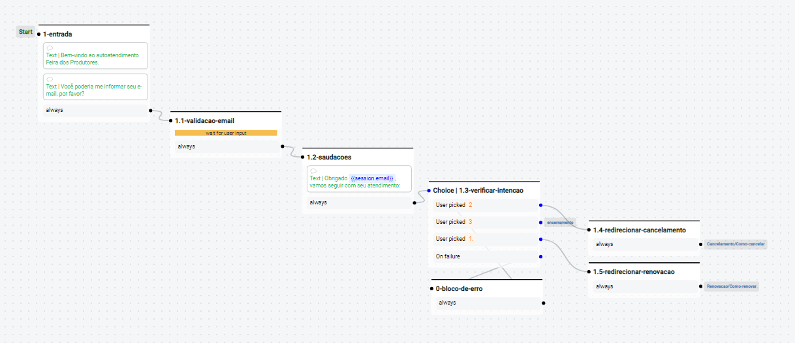
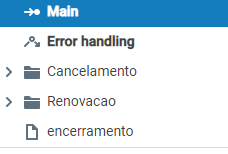

# Padrão de criação e desenvolvimento de fluxos

### Todos os fluxos apresentados nesse texto estarão disponíveis na nossa instância de [modelo](http://15.229.87.234/).
## Padrão de nomenclatura dos fluxos:

- Para melhor a manutenção e facilidade de correções em futuros bots, foi criado um padrão de fluxos.

- O padrão consiste no formato: *númerologia + hífen + descrição* do bloco separando por hífen. Como mostrado no exemplo abaixo:
```
🗒️1.1-validacao-email
    |       |
    |       |_🗒️ Descrição da funcionalidade do bloco
    |_🗒️ Numerologia   
```
## Exemplo de nomenclatura em <b>Node comum</b>:


## Esse padrão também irá ser considerado nos blocos de <b>Choice</b>:

### *O diferencial do bloco de tratativa de erro comparado com os demais node é o fator do prefixo começar com o numeral 0*.

#

## Recomendação de criação dos fluxos:

- Para manter uma ordem e facilitar a manutenção dos fluxos, foi de comum acordo respeitar o desenvolvimento no formato de <b>CASCATA</b>.

## Exemplo de desenvolvimento do fluxo em <b>Cascata</b>:


#
## Recomendação sobre quantidade de blocos por fluxo:

- Para não dificultar a manutenibilidade dos fluxos, iremos respeitar a criação de até 20 fluxos por página. Caso ultrapasse esse valor, será necessário refatorar e ramificar em pastas os arquivos de fluxos.

## Exemplo de fluxo <b>RUIM</b>:

### *Difícil manutenibilidade, difícil leitura e blocos em quantidade exarcebada*.

## Exemplo de fluxo <b>BOM</b>:

### *Fácil manutenção, leitura clara e objetiva, fluxo respeitando o máximo de 20 fluxos por página*.

### *Além disso, teremos uma organização também na estrutura de pastas*.

#

## Lembrando que essas <b>recomendações</b> são apenas boas práticas para seguirmos, caso não seja respeitado devemos validar e entender o cenário atual.